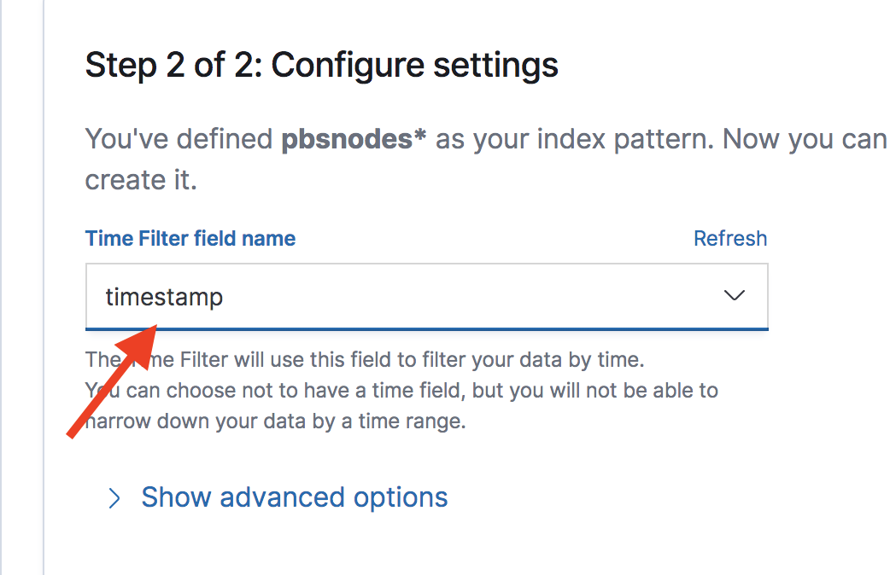
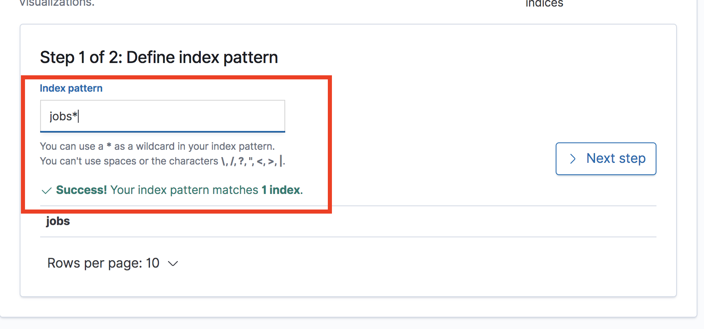
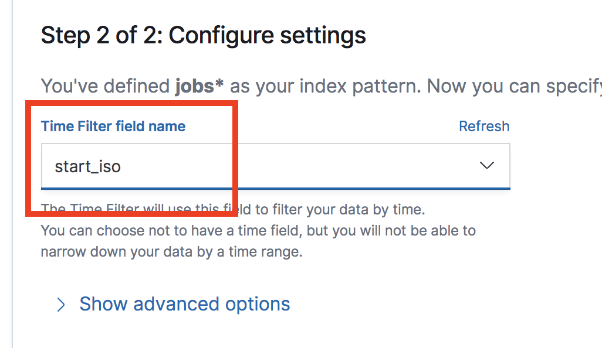
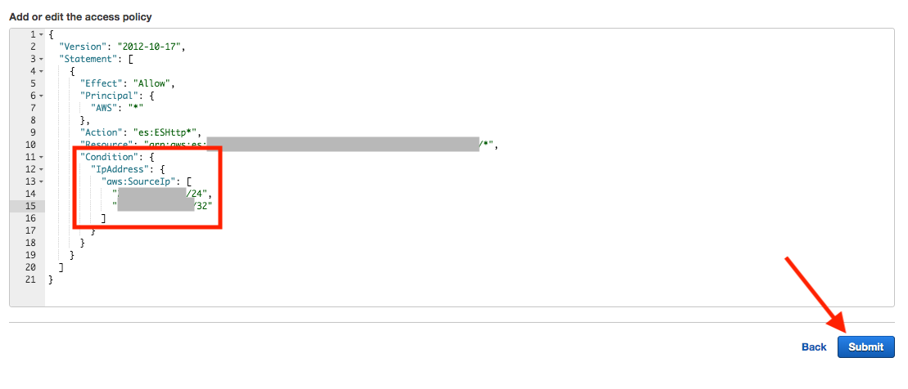

### Dashboard URL

Open your AWS console and navigate to CloudFormation. Select your parent Stack, click Output, and retrieve "WebUserInterface" 

### Create Indexes

Since it's the first time you access this endpoint, you will need to configure your indexes.  
First, access Kibana URL and click "Explore on my Own"

Go under Management and Click Index Patterns

Create your first index by typing **pbsnodes***.

Click next, and then specify the Time Filter key (**timestamp**). Once done, click Create Index Pattern.

Repeat the same operation for **jobs*** index 

This time,  select **start_iso** as time filter key.

Once your indexes are configured, go to Kibana, select "Discover" tab to start visualizing the data

### Index Information

|  | Cluster Node Information | Job Information |
| ------------------------ | ----------- | ---------- | 
| Kibana Index Name       | pbsnodes         | jobs        | 
| Data ingestion       | /apps/soca/cluster_analytics/cluster_nodes_tracking.py         | /apps/soca/cluster_analytics/job_tracking.py        | 
| Recurrence     | 1 minute         | 1 hour **(note: job must be terminated to be shown on ElasticSearch)**       | 
| Data uploaded         | Host Info (status of provisioned host, lifecycle, memory, cpu etc ..)         | Job Info (allocated hardware, licenses, simulation cost, job owner, instance type ...)        | 
| Timestamp Key   | Use "timestamp" when you create the index for the first time         | use "start_iso" when you create the index for the first time        | 
____

### Examples

#### Cluster Node

#### Job Metadata

### Troubleshooting access permission

Access to ElasticSearch is restricted to the IP you have specified during the installation. If your IP change for any reason, you won't be able to access the analytics dashboard and will get the following error message:
~~~json
{"Message":"User: anonymous is not authorized to perform: es:ESHttpGet"}
~~~

To solve this issue, log in to AWS Console  and go to ElasticSearch Service dashboard. Select  your ElasticSearch cluster and click "Modify Access Policy"

Finally, simply add your new IP under the "Condition" block, then click Submit

Please note it may take up to 5 minutes for your IP to be whitelisted

###[Create your own dashboard]({{ site.baseurl }}/analytics/build-kibana-dashboards/)