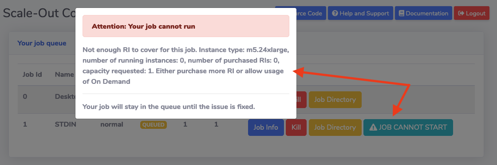

Scale-Out Computing on AWS offers multiple ways to make sure you will stay within budget while running your HPC workloads on AWS

## Limit who can submit jobs

Only allow specific individual users or/and LDAP groups to submit jobs. [Refer to this page for examples and documentation](../../security/manage-queue-acls/)

## Limit what type of EC2 instance can be provisioned 

Control what type of EC2 instances can be provisioned for any given queue. [Refer to this page for examples and documentation](../../security/manage-queue-instance-types/)

!!!info "Accelerated Computing Instances"
    Unless required for your workloads, it's recommended to exclude "p2", "p3", "g2", "g3", "p3dn" or other GPU instances type. 

## Force jobs to run only on Reserved Instances

You can limit a job to run only on Reserved Instances if you specify `force_ri=True` ([Documentation](../../tutorials/integration-ec2-job-parameters/#force_ri)) flag at job submission or for the entire queue.
Your job will stay in the queue if you do not have any Reserved Instance available.

## Limit the number of concurrent jobs or provisioned instances

You can limit the number of concurrent running jobs or provisioned instances at the queue level. Edit `queue_mapping.yml`, specify either `max_running_jobs` or `max_provisioned_instances` to the limit you do not want to exceed.
~~~bash hl_lines="4 5"
queue_type:
  compute:
    queues: ["myqueue"]
    max_running_jobs: 5
    max_provisioned_instances: 10
~~~

In this example, the maximum number of running job for "myqueue" will be 5. Similarly, jobs cannot request more than 10 instances (note: you can also limit the type/family of instances you want your user to provision)

These settings are independent so you can choose to either limit by # jobs, # instances, both or none.

## Create a budget

Creating an AWS Budget will ensure jobs can't be submitted if the budget allocated to the team/queue/project has exceeded the authorized amount.
[Refer to this page for examples and documentation](../../budget/set-up-budget-project/)

## Review your HPC cost in a central dashboard

Stay on top of your AWS costs in real time. Quickly visualize your overall usage and find answers to your most common questions:

- Who are my top users?

- How much money did we spend for Project A?

- How much storage did we use for Queue B?

- Where my money is going (storage, compute ...)

- Etc ...
  
[Refer to this page for examples and documentation](../../budget/review-hpc-costs/)

## Best practices

Assuming you are on-boarding a new team, here are our recommend best practices:

1 - [Create LDAP account for all users](../../tutorials/manage-ldap-users/#add-users)

2 - [Create LDAP group for the team. Add all users to the group](../../tutorials/manage-ldap-users/#other-ldap-operations)

3 - [Create a new queue](../../tutorials/create-your-own-queue/#queue-with-automatic-instance-provisioning)

4 - [Limit the queue to the LDAP group you just created](../../security/manage-queue-acls/#manage-acls-using-ldap-groups)

5 - [Limit the type of EC2 instances your users can provision](../../security/manage-queue-instance-types/)

6 - [If needed, configure restricted parameters](../../security/manage-queue-restricted-parameters/)

7 - [Create a Budget to make sure the new team won't spend more than what's authorized](../../budget/set-up-budget-project/)

8 - [Limit your job to only run on your Reserved Instances](../../budget/prevent-overspend-hpc-cost-on-aws-soca/#force-jobs-to-run-only-on-reserved-instances) or [limit the number of provisioned instances for your queue](../../budget/prevent-overspend-hpc-cost-on-aws-soca/#limit-the-number-of-concurrent-jobs-or-provisioned-instances)