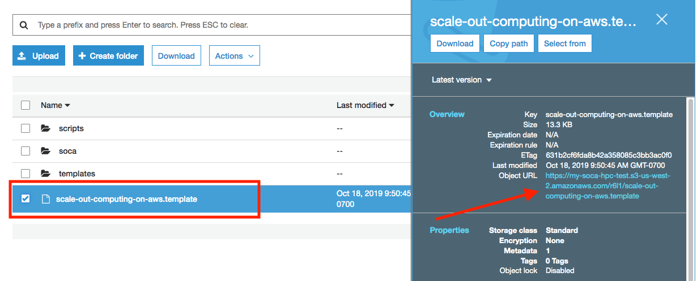
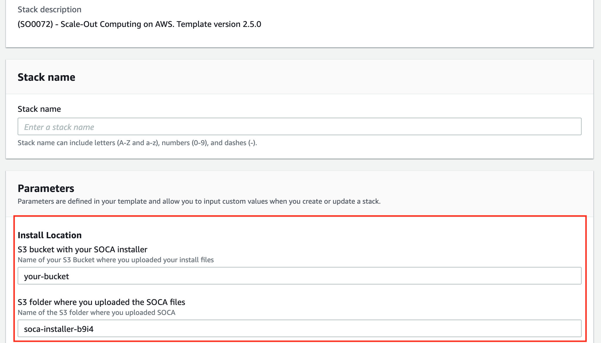
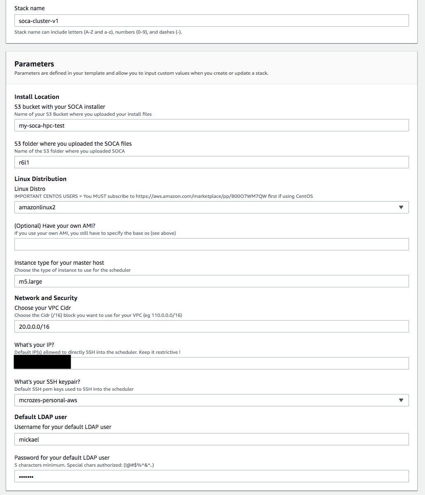
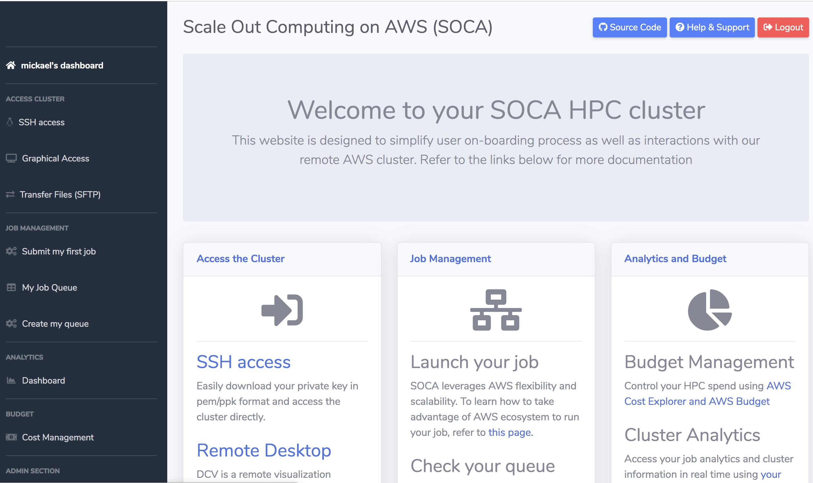

## Download SOCA

SOCA is open-source and available on Github ([https://github.com/awslabs/scale-out-computing-on-aws](https://github.com/awslabs/scale-out-computing-on-aws)).
To get started, simply clone the repository:

~~~bash
# Clone using HTTPS
user@host: git clone https://github.com/awslabs/scale-out-computing-on-aws .

# Clone using SSH
user@host: git clone git@github.com:awslabs/scale-out-computing-on-aws.git .
~~~

## Build your release
Once you have cloned your repository, execute `source/manual_build.py` using either python2 or python3

~~~~bash hl_lines="4"
user@host: python3 source/manual_build.py
====== SOCA Build ======

 > Generated unique ID for build: r6l1
 > Creating temporary build folder ...
 > Copying required files ...
 > Creating archive for build id: r6l1

====== Build COMPLETE ======

====== Installation Instructions ======
1: Create or use an existing S3 bucket on your AWS account (eg: 'mysocacluster')
2: Drag & Drop source/dist/r6l1 to your S3 bucket (eg: 'mysocacluster/dist/r6l1)
3: Launch CloudFormation and use scale-out-computing-on-aws.template as base template
4: Enter your cluster information.

Press Enter key to close ..
~~~~

This command create a build (`r6l1` in this example) under `source/dist/<build_id>` 

## Upload to S3

Go to your Amazon S3 bash and click "Create Bucket"

Choose a name and a region then click  "Create"

!!! warning "Avoid un-necessary charge"
    It's recommended to create your bucket in the same region as your are planning to use SOCA to avoid Cross-Regions charge (<a href="/https://aws.amazon.com/s3/pricing/"> See Data Transfer </a>)

Once your bucket is created, select it and click "Upload". Simply drag and drop your build folder  (`r6l1` in this example) to upload the content of the folder to S3.

!!! info
    You can use the same bucket to host multiple SOCA clusters

## Locate the install template

On your S3 bucket, click on the folder you just uploaded.

Your install template is located under `<S3_BUCKET_NAME>/<BUILD_ID>/scale-out-computing-on-aws.template`. Click on the object to retrieve the "Object URL"

## Install SOCA

Open CloudFormation bash and select "Create Stack". Copy the URL of your install template and click "Next".

!!! danger "Requirements"
    - No uppercase in stack name
    - Stack name is limited to 20 characters maximum (note: we automatically add soca- prefix)
    - Not supported on regions with less than 3 AZs (Canada / Northern California)

If you hit any issue during the installation, refer to the 'CREATE_FAILED' component and find the root cause by referring at "Physical ID"

Under stack details, choose the stack name (do not use uppercase or it will break your ElasticSearch cluster). 

- Install Parameters: Specify your S3 bucket you have uploaded your build (`my-soca-hpc-test` in this example) as well as the name of your build (`r6l1` in this example). If you haven't uploaded your build on your S3 root level, make sure you specify the entire file hierarchy.

- Environment Parameters: Choose your Linux Distribution, instance type for your master host, VPC CIDR, your IP which will be whitelisted for port 22, 80 and 443 as well as the root SSH keypair you want to use

- LDAP Parameters: Create a default LDAP user

!!!info "Disable Rollback on Failure if needed"
    If you face any challenge during the installation and need to do some troubleshooting, it's recommended to disable "Rollback On Failure" (under Advanced section)

Click Next two times and make sure to check "Capabilities" section. One done simply click "Create Stack". The installation procedure will take about 45 minutes.

## Post Install Verifications

Wait for CloudFormation stacks to be "CREATE_COMPLETE", then  select your base stack and click "Outputs"

Output tabs give you information about the SSH IP for the master, link to the web interface or ElasticSearch.

Even though Cloudformation resources are created, your environment might not be completely ready. 
To confirm whether or not SOCA is ready, try to SSH to the scheduler IP. If your SOCA cluster is not ready, your SSH will be rejected as shown below:

~~~bash
38f9d34dde89:~ mcrozes$ ssh -i mcrozes-personal-aws.pem ec2-user@<IP>
 ************* SOCA FIRST TIME CONFIGURATION *************
    Hold on, cluster is not ready yet.
    Please wait ~30 minutes as SOCA is being installed.
    Once cluster is ready to use, this message will be replaced automatically and you will be able to SSH.
 *********************************************************
Connection Closed.
~~~

If your SOCA cluster is ready, your SSH session will be accepted.

~~~bash
38f9d34dde89:~ mcrozes$ ssh -i mcrozes-personal-aws.pem ec2-user@<IP>
Last login: Mon Oct  7 21:37:21 2019 from <IP>

   _____  ____   ______ ___
  / ___/ / __ \ / ____//   |
  \__ \ / / / // /    / /| |
 ___/ // /_/ // /___ / ___ |
/____/ \____/ \____//_/  |_|
Cluster: soca-soca-cluster-v1
> source /etc/environment to load SOCA paths

[ec2-user@ip-20-0-28-184 ~]$
~~~

At this point, you will be able to access the web interface and log in with the default LDAP user you specified at launch creation

## What's next ?

Learn [how to access your cluster](/access-soca-cluster/), [how to submit your first job](/tutorials/launch-your-first-job/) or even [how to change your SOCA DNS](/tutorials/update-soca-dns-ssl-certificate/) to match your personal domain name.

## Project Structure
Refer to the project structure below if you want to deploy your own customization
~~~bash
.
├── solution-for-scale-out-computing-on-aws.template    [ Soca Install Template ]
├── soca                           
│   ├── cluster_analytics                               [ Scripts to ingest cluster/job data into ELK ]
│   ├── cluster_hooks                                   [ Scheduler Hooks ]
│   ├── cluster_logs_management                         [ Scripts to manage cluster log rotation ]
│   ├── cluster_manager                                 [ Scripts to control Soca cluster ]
│   └── cluster_web_ui                                  [ Web Interface ]
├── scripts                                             
│   ├── ComputeNode.sh                                  [ Configure Compute Node ]
│   ├── ComputeNodeInstallDCV.sh                        [ Configure DCV Host ]
│   ├── ComputeNodePostReboot.sh                        [ Post Reboot Compute Node actions ]
│   ├── ComputeNodeUserCustomization.sh                 [ User customization ]
│   ├── config.cfg                                      [ List of all packages to install ]
│   ├── Scheduler.sh                                    [ Configure Schedule Node ]
│   └── SchedulerPostReboot.sh                          [ Post Reboot Scheduler Node actions ]
└── templates                              
    ├── Analytics.template                              [ Manage ELK stack for your cluster ]
    ├── ComputeNode.template                            [ Manage simulation nodes ]
    ├── Configuration.template                          [ Centralize cluster configuration ]
    ├── Network.template                                [ Manage VPC configuration ]
    ├── Scheduler.template                              [ Manage Scheduler host ]
    ├── Security.template                               [ Manage ACL, IAM and SGs ]
    ├── Storage.template                                [ Manage backend storage ]
    └── Viewer.template                                 [ Manage DCV sessions ]
~~~
