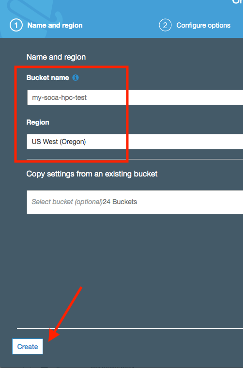
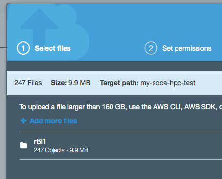
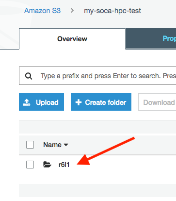
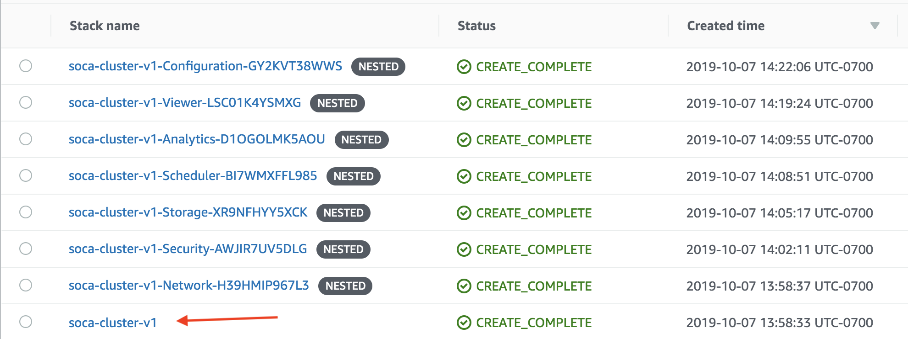
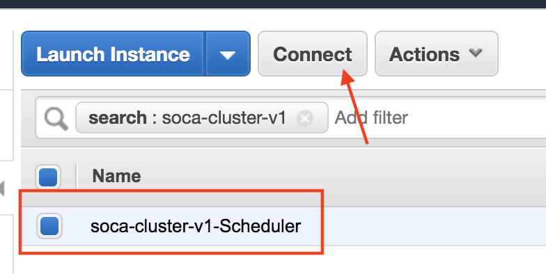

## Download Scale-Out Computing on AWS

Scale-Out Computing on AWS is open-source and available on Github ([https://github.com/awslabs/scale-out-computing-on-aws](https://github.com/awslabs/scale-out-computing-on-aws)).
To get started, simply clone the repository:

~~~bash
# Clone using HTTPS
user@host: git clone https://github.com/awslabs/scale-out-computing-on-aws .

# Clone using SSH
user@host: git clone git@github.com:awslabs/scale-out-computing-on-aws.git .
~~~

## Build your release
Once you have cloned your repository, execute `source/manual_build.py` using either python2 or python3

~~~~bash hl_lines="4"
user@host: python3 source/manual_build.py
====== Scale-Out Computing on AWS Build ======

 > Generated unique ID for build: r6l1
 > Creating temporary build folder ...
 > Copying required files ...
 > Creating archive for build id: r6l1

====== Build COMPLETE ======

====== Installation Instructions ======
1: Create or use an existing S3 bucket on your AWS account (eg: 'mysocacluster')
2: Drag & Drop source/dist/r6l1 to your S3 bucket (eg: 'mysocacluster/dist/r6l1)
3: Launch CloudFormation and use scale-out-computing-on-aws.template as base template
4: Enter your cluster information.

Press Enter key to close ..
~~~~

This command create a build (`r6l1` in this example) under `source/dist/<build_id>` 

## Upload to S3

Go to your Amazon S3 console and click "Create Bucket"

Choose a name and a region then click  "Create"

!!! warning "Avoid un-necessary charge"
    It's recommended to create your bucket in the same region as your are planning to use Scale-Out Computing on AWS to avoid Cross-Regions charge (<a href="/https://aws.amazon.com/s3/pricing/"> See Data Transfer </a>)

Once your bucket is created, select it and click "Upload". Simply drag and drop your build folder  (`r6l1` in this example) to upload the content of the folder to S3.

!!! info
    You can use the same bucket to host multiple Scale-Out Computing on AWS clusters

## Locate the install template

On your S3 bucket, click on the folder you just uploaded.

Your install template is located under `<S3_BUCKET_NAME>/<BUILD_ID>/scale-out-computing-on-aws.template`. Click on the object to retrieve the "Object URL"

!!! info "Want to use your existing AWS resources?"
    Refer to `install-with-existing-resources.template` if you want to use Scale-Out Computing on AWS with your existing resources.
    
    [Check out the web installer](https://install.soca.dev) to verify your setup

## Install Scale-Out Computing on AWS

Open CloudFormation console and select "Create Stack". Copy the URL of your install template and click "Next".

!!! danger "Requirements"
    - No uppercase in stack name
    - Stack name is limited to 20 characters maximum (note: we automatically add soca- prefix)
    - Not supported on regions with less than 3 AZs (Canada / Northern California)

If you hit any issue during the installation, refer to the 'CREATE_FAILED' component and find the root cause by referring at "Physical ID"

Under stack details, choose the stack name (do not use uppercase or it will break your ElasticSearch cluster). 

- Install Parameters: Specify your S3 bucket you have uploaded your build (`my-soca-hpc-test` in this example) as well as the name of your build (`r6l1` in this example). If you haven't uploaded your build on your S3 root level, make sure you specify the entire file hierarchy.

- Environment Parameters: Choose your Linux Distribution, instance type for your master host, VPC CIDR, your IP which will be whitelisted for port 22, 80 and 443 as well as the root SSH keypair you want to use

- LDAP Parameters: Create a default LDAP user

!!!info "Disable Rollback on Failure if needed"
    If you face any challenge during the installation and need to do some troubleshooting, it's recommended to disable "Rollback On Failure" (under Advanced section)

Click Next two times and make sure to check "Capabilities" section. One done simply click "Create Stack". The installation procedure will take about 45 minutes.

## Post Install Verifications

Wait for CloudFormation stacks to be "CREATE_COMPLETE", then  select your base stack and click "Outputs"

Output tabs give you information about the SSH IP for the master, link to the web interface or ElasticSearch.

Even though Cloudformation resources are created, your environment might not be completely ready. 
To confirm whether or not Scale-Out Computing on AWS is ready, try to SSH to the scheduler IP. If your Scale-Out Computing on AWS cluster is not ready, your SSH will be rejected as shown below:

~~~bash
38f9d34dde89:~ mcrozes$ ssh -i mcrozes-personal-aws.pem ec2-user@<IP>
 ************* Scale-Out Computing on AWS FIRST TIME CONFIGURATION *************
    Hold on, cluster is not ready yet.
    Please wait ~30 minutes as Scale-Out Computing on AWS is being installed.
    Once cluster is ready to use, this message will be replaced automatically and you will be able to SSH.
 *********************************************************
Connection Closed.
~~~

If your Scale-Out Computing on AWS cluster is ready, your SSH session will be accepted.

~~~bash
38f9d34dde89:~ mcrozes$ ssh -i mcrozes-personal-aws.pem ec2-user@<IP>
Last login: Mon Oct  7 21:37:21 2019 from <IP>

   _____  ____   ______ ___
  / ___/ / __ \ / ____//   |
  \__ \ / / / // /    / /| |
 ___/ // /_/ // /___ / ___ |
/____/ \____/ \____//_/  |_|
Cluster: soca-cluster-v1
> source /etc/environment to load Scale-Out Computing on AWS paths

[ec2-user@ip-20-0-5-212 ~]$
~~~

At this point, you will be able to access the web interface and log in with the default LDAP user you specified at launch creation

## What if SSH port (22) is blocked by your IT?

Scale-Out Computing on AWS supports [AWS Session Manager](https://docs.aws.amazon.com/systems-manager/latest/userguide/session-manager.html) in case you corporate firewall is blocking SSH port (22). SSM let you open a secure shell on your EC2 instance through a secure web-based session.

First, access your AWS EC2 Console and select your Scheduler instance, then click "Connect" button

{: style="height:250x;width:500px"}

Select "Session Manager" and click Connect

{: style="height:300px;width:550px"}

You now have access to a secure shell directly within your browser

## Enable Termination Protection

This step is optional yet higly recommended. AWS CloudFormation allows you to protect a stack from being accidently deleted. If you attempt to delete a stack with termination protection enabled, the deletion fails and the stack, including its status, will remain unchanged.
To enable "Termination Protect" select your Primary template and click "Stack Action" button then "Edit Termination Protection". Choose "Enabled" and click Save. Choose "Disabled" if you want to be able to delete the stack again.

## Important Services

!!!note 
    All services on SOCA will automatically restart if you restart your scheduler instance
   
Run the following command (as root) if you want to restart any service: 

   - Scheduler: `service pbs start`
   - SSSD: `service sssd start`
   - OpenLDAP: `service openldap start`
   - Web UI `/apps/soca/cluster_web_ui/socawebui.sh start`
   - NFS partitions `mount -a` (mount configuration is available on `/etc/fstab`)

## Operational Metrics

This solution includes an option to send anonymous operational metrics to AWS. We use this data to better understand how customers use this solution and related services and products. 
Note that AWS will own the data gathered via this survey. Data collection will be subject to the [AWS Privacy Policy](https://aws.amazon.com/privacy/). 

To opt out of this feature, modify the `/apps/soca/cluster_manager/cloudformation_builder` and set `allow_anonymous_data_collection` variable to `False`

When enabled, the following information is collected and sent to AWS:

       - Solution ID: The AWS solution identifier
       - Base Operating System: The operating system selected for the solution deployment
       - Unique ID (UUID): Randomly generated, unique identifier for each solution deployment
       - Timestamp: Data-collection timestamp
       - Instance Data: Type or count of the state and type of instances that are provided for by the Amazon EC2 scheduler instance for each job in each AWS Region
       - Keep Forever: If instances are running when no job is running
       - EFA Support: If EFA support was selected
       - Spot Support: If Spot support was invoked for new auto-scaling stacks
       - Stack Creation Version: The version of the stack that is created or deleted
       - Status: The status of the stack (stack_created or stack_deleted)
       - Scratch Disk Size: The size of the scratch disk selected for each solution deployment
       - Region: The region where the stack is deployed
       - FSxLustre: If the job is using FSx for Lustre

## What's next ?

Learn [how to access your cluster](/access-soca-cluster/), [how to submit your first job](/tutorials/launch-your-first-job/) or even [how to change your Scale-Out Computing on AWS DNS](/security/update-soca-dns-ssl-certificate/) to match your personal domain name.

