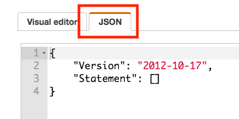
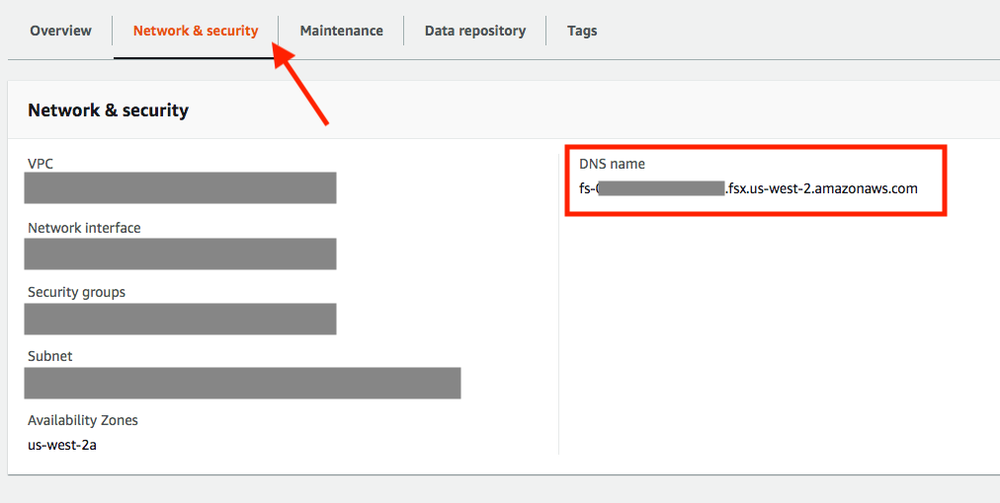

## What is FSx
[Amazon FSx](https://aws.amazon.com/fsx/) provides you with the native compatibility of third-party file systems with feature sets for workloads such as high-performance computing (HPC), machine learning and electronic design automation (EDA). You don’t have to worry about managing file servers and storage, as Amazon FSx automates the time-consuming administration tasks such as hardware provisioning, software configuration, patching, and backups.
Amazon FSx provides FSx for Lustre for compute-intensive workloads. 

!!! info "Please note the following when using FSx on Scale-Out Computing on AWS"
    - FSx is supported natively (Linux clients, security groups and backend configuration is automatically managed by Scale-Out Computing on AWS)
    - You can launch an ephemeral FSx filesystem for your job
    - You can connect to an existing FSx filesystem
    - You can dynamically adjust the storage capacity of your FSx filesystem
    - Exported files (if any) from FSx to S3 will be stored under `s3://<YOUR_BUCKET_NAME>/<CLUSTER_ID>-fsxoutput/job-<JOB_ID>/`

## Pre-requisite for FSx for Lustre

You need to give Scale-Out Computing on AWS the permission to map the S3 bucket you want to mount on FSx. To do that, add a new inline policy to the **scheduler IAM role**. The Scheduler IAM role can be found on the IAM bash and is named `<SOCA_AWS_STACK_NAME>-Security-<UUID>-SchedulerIAMRole-<UUID>`.
To create an inline policy, select your IAM role, click "Add Inline Policy":

Select "JSON" tab

Finally copy/paste the JSON policy listed below (make sure to adjust to your bucket name), click "Review" and "Create Policy".
~~~json
{
    "Version": "2012-10-17",
    "Statement": [
        {
            "Sid": "AllowAccessFSxtoS3",
            "Effect": "Allow",
            "Action": "s3:*",
            "Resource": [
                "arn:aws:s3:::<YOUR_BUCKET_NAME>",
                "arn:aws:s3:::<YOUR_BUCKET_NAME>/*"
            ]
        }
    ]
}
~~~

To validate your policy is effective, access the scheduler host and run the following commmand:

~~~bash
## Example when IAM policy is not correct
user@host: aws s3 ls s3://<YOUR_BUCKET_NAME>

An error occurred (AccessDenied) when calling the ListObjectsV2 operation: Access Denied

## Example when IAM policy is valid (output will list content of your bucket)
user@host: aws s3 ls s3://<YOUR_BUCKET_NAME>
2019-11-02 04:26:27       2209 dataset1.txt
2019-11-02 04:26:39      10285 dataset2.csv
~~~

!!!warning 
    This permission will give scheduler host access to your S3 bucket, therefore you want to limit access to this host to approved users only.
    DCV sessions or other compute nodes <strong> will not </strong> have access to the S3 bucket.

## Provision FSx for your job

For this example, let's say I have my dataset available on S3 and I want to access them for my simulation.
Submit a job using `-l fsx_lustre_bucket=s3://<YOUR_BUCKET_NAME>`. The bucket will then be mounted on all nodes provisioned for the job under `/fsx` mountpoint.

~~~bash
user@host: qsub -l fsx_lustre_bucket=s3://<YOUR_BUCKET_NAME> -- /bin/sleep 600
~~~

This command will provision a new 1200 GB (smallest capacity available) FSx filesystem for your job:

Your job will automatically start as soon as both your FSx filesystem and compute nodes are available. Your filesystem will be available on all nodes allocated to your job under `/fsx`

~~~bash
user@host: df -h /fsx
Filesystem             Size  Used Avail Use% Mounted on
200.0.170.60@tcp:/fsx  1.1T  4.4M  1.1T   1% /fsx

## Verify the content of your bucket is accessible
user@host: ls -ltr /fsx
total 1
-rwxr-xr-x 1 root root  2209 Nov  2 04:26 dataset1.txt
-rwxr-xr-x 1 root root 10285 Nov  2 04:26 dataset2.csv
~~~

Your FSx filesystem will automatically be terminated when your job complete. [Refer to this link](https://docs.aws.amazon.com/fsx/latest/LustreGuide/fsx-data-repositories.html) to learn how to interact with FSx data repositories. 

## Change FSx capacity

Use `-l fsx_lustre_size=<SIZE_IN_GB>` to specify the size of your FSx filesystem. Please note the following informations:
- If not specified, Scale-Out Computing on AWS deploy the smallest possible capacity (1200GB)
- Valid sizes (in GB) are 1200, 2400, 3600 and increments of 3600

~~~bash
user@host: qsub  -l fsx_lustre_size=3600 -l fsx_lustre_bucket=s3://<YOUR_S3_BUCKET> -- /bin/sleep 600
~~~

This command will mount a 3.6TB FSx filesystem on all nodes provisioned for your simulation.

## How to connect to a permanent/existing FSx 

If you already have a running FSx, you can mount it using `-l fsx_lustre_dns` variable.

~~~bash
user@host: qsub -l fsx_lustre_dns=<MY_FSX_DNS> -- /bin/sleep 60
~~~

To retrieve your FSx DNS, select your filesystem and select "Network & Security"

!!! warning
    - Make sure your FSx is running on the same VPC as Scale-Out Computing on AWS</li>
    - Make sure your FSx security group allow traffic from/to Scale-Out Computing on AWS ComputeNodes SG</li>
    - If you specify both "fsx_lustre_bucket" and "fsx_lustre_dns", only "fsx_lustre_dns" will be mounted.</li>

## How to change the mountpoint

By default Scale-Out Computing on AWS mounts fsx on `/fsx`. If you need to change this value, edit `scripts/ComputeNode.sh` update the value of `FSX_MOUNTPOINT`.

~~~bash hl_lines="4"
...
if [[ $SOCA_AWS_FSX_LUSTRE_BUCKET != 'false' ]]; then
    echo "FSx request detected, installing FSX Lustre client ... "
    FSX_MOUNTPOINT="/fsx" ## <-- Update mountpoint here
    mkdir -p $FSX_MOUNTPOINT
    ...
~~~

## Learn about the other storage options on Scale-Out Computing on AWS
[Click here to learn about the other storage options](../understand-storage-backend-options-scratch/) offered by Scale-Out Computing on AWS.

## Troubleshooting and most common errors

Like any other parameter, FSx options can be debugged using `/apps/soca/cluster_manager/logs/<QUEUE_NAME>.log`

~~~bash
[Error while trying to create ASG: Scale-Out Computing on AWS does not have access to this bucket. 
Update IAM policy as described on the documentation]
~~~

**Resolution**: Scale-Out Computing on AWS does not have access to this S3 bucket. Update your IAM role with the policy listed above

~~~bash
[Error while trying to create ASG: fsx_lustre_size must be: 1200, 2400, 3600, 7200, 10800]
~~~
**Resolution**: fsx_lustre_size must be 1200, 2400, 3600 and increments of 3600
