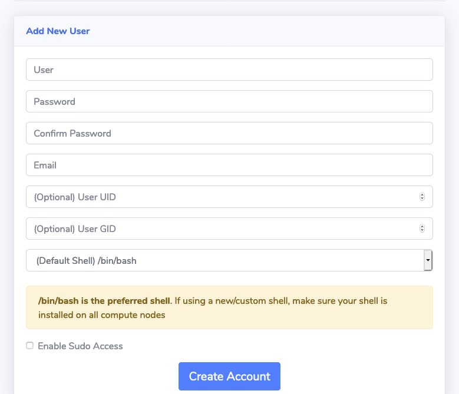
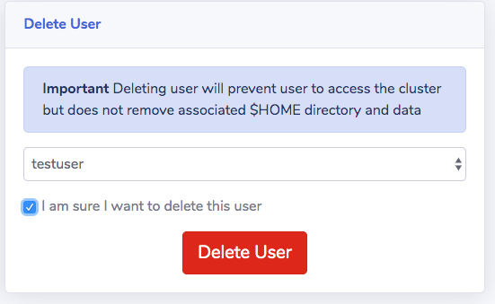

## Using Web UI

Log in to the Web UI with an admin account and locate =="Users"== section on the left sidebar


### Add users
To create a new user, simply fill out the "Create New User" form. Select whether or not the user will be an admin by checking  =="Enable Sudo Access"== checkbox



You will see a success message if the user is created correctly


!!!info "What is a SUDO user?"
    Users will SUDO permissions will be admin on the cluster and authorized to run any sudo command. Make sure to limit this ability to HPC/AWS/Linux admins and other power users.


### Delete users
To delete a user, select the user you want to delete and check the checkbox



You will see a success message if the user is deleted correctly


!!!danger "Non-Admins users"
    Users without "Sudo" are not authorized to manage LDAP accounts.
    

## Using command-line interface

If you need to manage the permission programatically, access the scheduler host and execute `/apps/soca/cluster_manager/ldap_manager.py`

~~~bash
python3 /apps/soca/cluster_manager/ldap_manager.py add-user -u newuser -p mynottoosecurepassword
Created User: newuser id: 5002
Created group successfully
Home directory created correctly
~~~

Users created via CLI are visible to the web-ui and vice versa

## Other LDAP operations

Scale-Out Computing on AWS uses OpenLDAP and you can interact with your directory using LDIF directly.

!!!info "Scale-Out Computing on AWS LDAP Schema"
    - People: OU=People,DC=soca,DC=local
    - Groups: OU=Group,DC=soca,DC=local
    - Sudoers: OU=Sudoers,DC=soca,DC=local (This OU manages sudo permission on the cluster)

!!!success "Admin LDAP account credentials"
    - Bind DN (-D): cn=admin,dc=soca,dc=local 
    - Password (-y) /root/OpenLdapAdminPassword.txt

For example, if you want to create a new group, create a new LDIF file (mynewgroup.ldif) and add the following content:

```ldap
dn: cn=mynewgroup,ou=Group,dc=soca,dc=local
objectClass: top
objectClass: posixGroup
cn: mynewgroup
gidNumber: 6000
memberUid: mytestuser
```

Run the following `ldapadd` command to add your new group:
```bash
ldapadd -x -D cn=admin,dc=soca,dc=local -y /root/OpenLdapAdminPassword.txt -f mynewgroup.ldif
adding new entry "cn=mynewgroup,ou=Group,dc=soca,dc=local"
```

Finally valid your group has been created correctly using `ldapsearch`
```bash hl_lines="12"
# Validate with Ldapsearch
~ ldapsearch -x cn=mynewgroup
#Extended LDIF
#
# LDAPv3
# base DC=soca,DC=local (default) with scope subtree
# filter: cn=mynewgroup
# requesting: ALL
#

# mynewgroup, Group, soca.local
dn: cn=mynewgroup,ou=Group,dc=soca,dc=local
objectClass: top
objectClass: posixGroup
cn: mynewgroup
gidNumber: 6000
memberUid: mytestuser
```

Example for LDIF modify operation
```
dn: cn=mynewgroup,ou=Group,dc=soca,dc=local
changetype: modify
add: memberUid
memberUid: anotheruser
```
Example for LDIF delete operation
```
dn: cn=mynewgroup,ou=Group,dc=soca,dc=local
changetype: modify
delete: memberUid
memberUid:: anotheruser # you get the memberUid by running a simple ldapsearch first
```

## Give users permissions to submit job

By default, users can submit job to any queue, however you [can set up ACL at queue level if needed](../../tutorials/manage-queue-acls/)