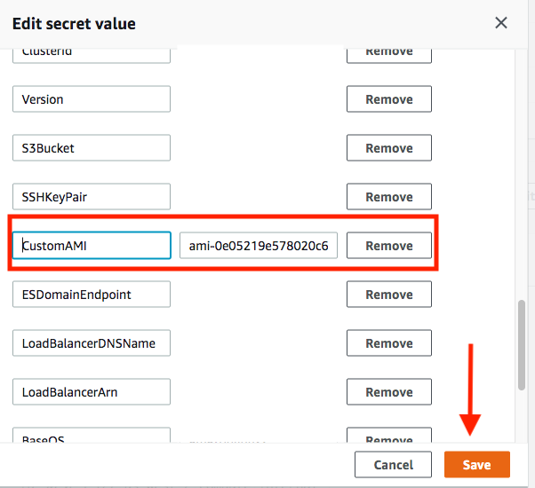

By default, SOCA provision a vanilla AMI and install all required packages in ~3 to 5 minutes. 
If this cold time is not acceptable for your workload, you can [launch AlwaysOn instance](../tutorials/launch-always-on-instances/) or pre-bake your AMI with all required libraries.

### Step 1: Locate your base AMI

Run `cat /etc/environment | grep SOCA_INSTALL_AMI` on your scheduler host

~~~bash hl_lines="13"
$ ssh -i <key> ec2-user@<ip>
Last login: Wed Oct  2 20:06:47 2019 from <ip>

   _____  ____   ______ ___
  / ___/ / __ \ / ____//   |
  \__ \ / / / // /    / /| |
 ___/ // /_/ // /___ / ___ |
/____/ \____/ \____//_/  |_|
Cluster: soca-uiupdates
> source /etc/environment to SOCA paths

[ec2-user@ip-30-0-1-28 ~]$ cat /etc/environment | grep SOCA_INSTALL_AMI
export SOCA_INSTALL_AMI=ami-082b5a644766e0e6f
[ec2-user@ip-30-0-1-28 ~]$
~~~

### Step 2: Launch a temporary EC2 instance

Launch a new EC2 instance using the `SOCA_INSTALL_AMI` image

### Step 3: Pre-configure your AMI

#### 3.1 Pre-Install system packages
You can pre-install the packages listed on [https://github.com/awslabs/scale-out-computing-on-aws/blob/master/source/scripts/config.cfg](https://github.com/awslabs/scale-out-computing-on-aws/blob/master/source/scripts/config.cfg). You will need to run `yum install` for:

- SYSTEM_PKGS
- SCHEDULER_PKGS
- OPENLDAP_SERVER_PKGS
- SSSD_PKGS

!!!info "Easy Install"    
    - Copy the content of the `config.cfg` on your filesystem (say `/root/config.cfg`)
    - Run `source /root/config.cfg`
    - Run the following commands:
        - `yum install -y $(echo ${SYSTEM_PKGS[*]}`
        - `yum install -y $(echo ${SCHEDULER_PKGS[*]})`
        - `yum install -y $(echo ${OPENLDAP_SERVER_PKGS[*]})`
        - `yum install -y $(echo ${SSSD_PKGS[*]})`
    
    ____
    [Here is an example](https://github.com/awslabs/scale-out-computing-on-aws/blob/master/source/scripts/ComputeNode.sh#L26) of how you can install packages listed in an array in bash.

#### 3.2: Pre-Install the scheduler
To reduce the launch time of your EC2 instance, it's recommended to pre-install PBSPro. 
First, refer to [https://github.com/awslabs/scale-out-computing-on-aws/blob/master/source/scripts/config.cfg](https://github.com/awslabs/scale-out-computing-on-aws/blob/master/source/scripts/config.cfg) and note all PBSPro related variables as you will need to use them below (see highlighted lines):

~~~bash hl_lines="5 6 7"
# Sudo as Root
sudo su -

# Define PBSPro variable
export PBSPRO_URL=<variable_from_config.txt> # ex https://github.com/PBSPro/pbspro/releases/download/v18.1.4/pbspro-18.1.4.tar.gz
export PBSPRO_TGZ=<variable_from_config.txt> # ex pbspro-18.1.4.tar.gz
export PBSPRO_VERSION=<variable_from_config.txt> # ex 18.1.4

# Run the following command to install PBS
cd ~
wget $PBSPRO_URL
tar zxvf $PBSPRO_TGZ
cd pbspro-$PBSPRO_VERSION
./autogen.sh
./configure --prefix=/opt/pbs
make -j6
make install -j6
/opt/pbs/libexec/pbs_postinstall
chmod 4755 /opt/pbs/sbin/pbs_iff /opt/pbs/sbin/pbs_rcp
~~~

!!!note "Installation Path"
    Make sure to install pbspro under `/opt/pbs`

### Step 4: Create your AMI
Once you are done, go back to EC2 console, locate your instance and click "Actions > Image > Create Image"

Choose an AMI name and click 'Create Image'.

Your AMI is now being created. Please note it may take a couple of minutes for the AMI to be ready. To check the status, go to EC2 Console and then click "AMIs" on the left sidebar

!!!warning "Stop your temporary EC2 instance"
    Once your AMI has been created, you can safely terminate the EC2 instance you just launched as you won't need it anymore.

### Step 5: Test your new AMI

~~~bash hl_lines="2 5"
# Test 1: Submit a job with a vanilla AMI
$ qsub -l instance_type=c5.9xlarge -- /bin/date 

# Test 2: Submit a job with a pre-configured AMI
$ qsub -l instance_type=c5.9xlarge -l instance_ami=ami-0e05219e578020c64 -- /bin/date 
~~~

**Results:**

- Test1 (Vanilla): **3 minutes 45 seconds** to provision EC2 capacity, register node on SOCA and start the job
- Test2 (Pre-Configured): **1 minute 44 seconds** to provision EC2 capacity, register host on SOCA and start the job
 
### Step 6: Update default AMI (Optional)

#### Single job
As you are planning to use a custom AMI, you will be required to specify `-l instance_ami=<IMAGE_ID>` at job submission.
It's recommended to go with the "Entire Queue" option below if you do not want to manually specify this resource each time you submit a job

#### Entire queue
Edit `/apps/soca/cluster_manager/settings/queue_mapping.yml` and update the default AMI

~~~yaml hl_lines="4"
queue_type:
  compute:
    queues: ["queue1", "queue2", "queue3"] 
    instance_ami: "<YOUR_AMI_ID>" # <- Add your new AMI 
    instance_type: ...
~~~

Any jobs running in the queue configured on the `queue_mapping` will now use your pre-configured AMI by default. You do not need to specify `-l instance_ami` at job submission anymore.

#### Entire cluster

If you want to change the default AMI to use regardless of queue/job, open your Secret Manager console and select your Scale-Out Computing on AWS cluster configuration. Click “Retrieve Secret Value” and then “Edit”.
Find the entry “CustomAMI” and update the value with your new AMI ID then click Save

