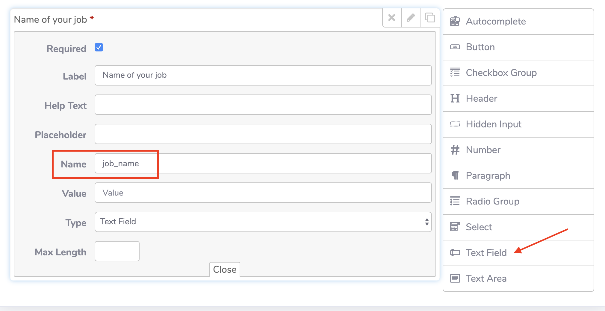
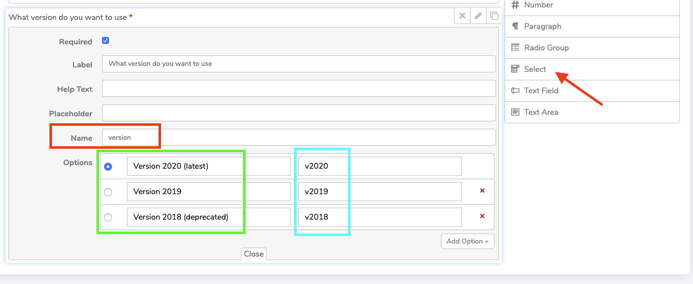
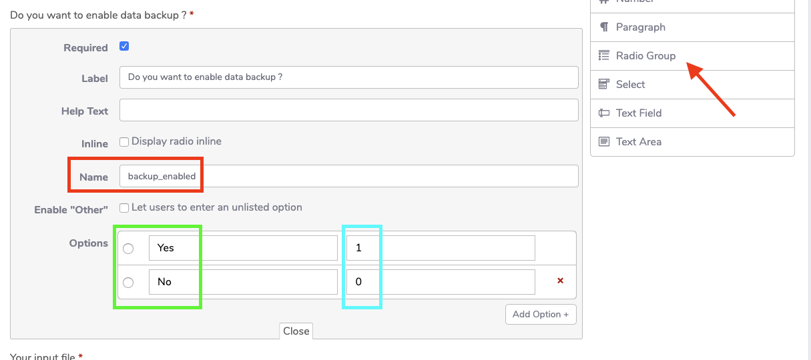
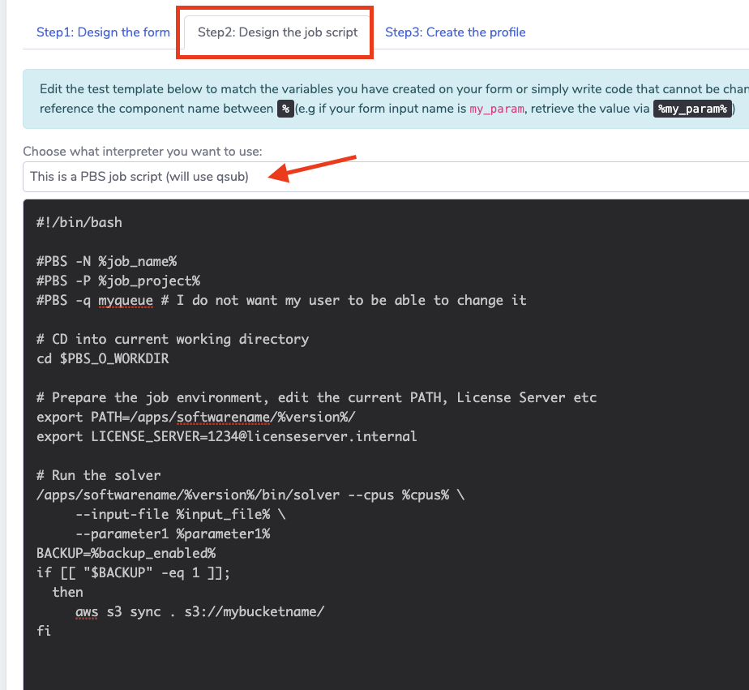
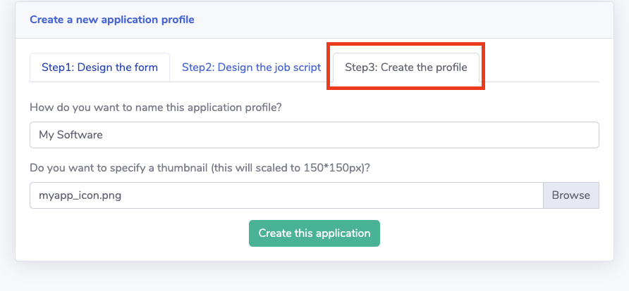
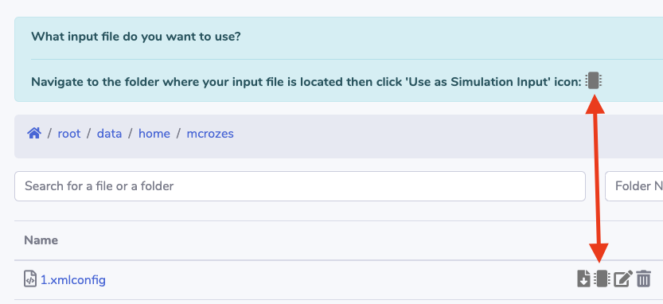
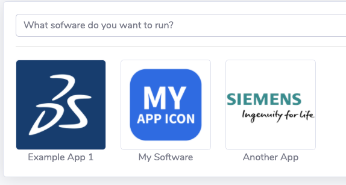
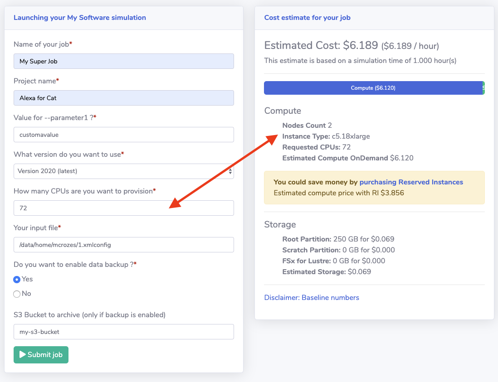
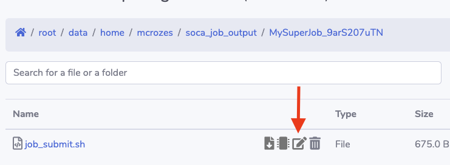
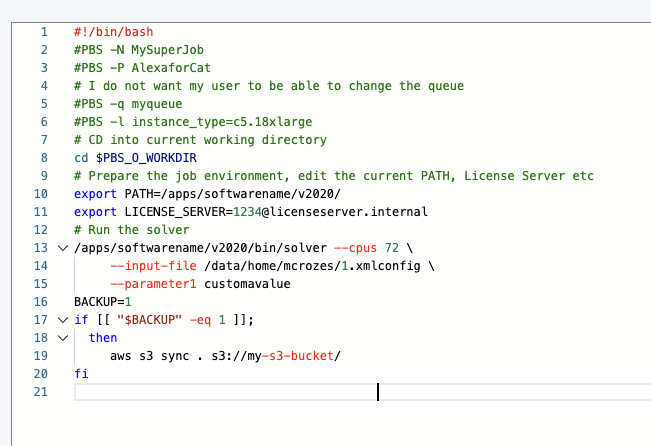

On this page, you will learn how to create an application profile and give your users the ability to submit HPC jobs via a simple web interface
## Build the job script

The first step is to identify the variables you want your users to configure. Let's take this simple job file for reference:

~~~bash
#PBS -N MyJobName
#PBS -P MyJobProject
#PBS -q queue_1
#PBS -l instance_type=c5.18xlarge

# CD into current working directory
cd $PBS_O_WORKDIR 

# Prepare the job environment, edit the current PATH, License Server etc
export PATH=/apps/softwarename/v2020/
export LICENSE_SERVER=1234@licenseserver.internal

# Run the solver
/apps/softwarename/v2020/bin/solver --cpus 36 \
     --input-file myfile.input \
     --parameter1 value1

# Once job is complete, archive output to S3
BACKUP=1
if [[ "$BACKUP" -eq 1 ]]; 
  then
     aws s3 sync . s3://mybucketname/
fi
~~~

Simply replace the values/parameters you want your users to configure with ==%VARIABLE_NAME%== such as:

~~~bash
#PBS -N %job_name%
#PBS -P %job_project%
# I do not want my user to be able to change the queue
#PBS -q myqueue 
#PBS -l instance_type=%instance_type%

# CD into current working directory
cd $PBS_O_WORKDIR 

# Prepare the job environment, edit the current PATH, License Server etc
export PATH=/apps/softwarename/%version%/
export LICENSE_SERVER=1234@licenseserver.internal

# Run the solver
/apps/softwarename/%version%/bin/solver --cpus %cpus% \
     --input-file %input_file% \
     --parameter1 %parameter1%

# Once job is complete, archive output to S3
BACKUP=%backup_enabled%
if [[ "$BACKUP" -eq 1 ]]; 
  then
     aws s3 sync . s3://%bucket_to_archive%/
fi
~~~

In this example:

- %job_name% will be replaced by the actual job name specified by the user
- %job_project% will be replaced by the project associated to the job 
- %version% will let the user decide what software version to use
- %cpus% , %input_file%, and %parameter1% are application specific parameters
- %backup_enabled% will determine if we want to archive the job output to S3
- %bucket_to_archive% will point to the user's personal S3 bucket

## Create the HTML form

As a HPC admin, navigate to "Application Management" tab. Now that you have identified all variables, you must create their associated HTML components:

#### %job_name% , %job_project%, %bucket_to_archive%, %input_file% and %parameter1%

Drag "Text Field" component from the left section to add it to the form.

Configure the widget and configure the Name settings (red) with the variable name associated (job_name in our example)

In the example below, the value entered by the user for ==job_name== will be sent to the job script and retrieved via ==%job_name%== 

Repeat the same operation for %job_project%, %bucket_to_archive%, %parameter1% and %input_file%

!!!note 
    %input_file% will automatically be configured with the path of the input file selected by the user

#### %instance_type%

We want to enforce the instance type to be c5.18xlarge. To do that, you can simply hardcode the information on the job script or create a "Hidden Input" parameter.
The red section references to the variable name and the green section is the variable value.

#### %cpus%

For %cpus% variable, we recommend using the "Number" component

Specify a name which match your variable name (red), pick the default value (green, optional) then choose the Min/Max/Step values allowed (blue)

#### %version%

Assuming your application is installed:

- /apps/softwarename/v2020
- /apps/softwarename/v2019
- /apps/softwarename/v2018

This time, we recommend you using the "Select" component:

Similarly to the previous examples, check the "Required" checkbox, map the "Name" to your variable (%version%) and add labels (green) and their associated values (blue)

#### %backup_enabled%

%backup_enabled% is a boolean which enable (1) or disable (0) data archival to S3. This time use "Radio Group" component and configure the different values

## Configure the job script

Once your HTML form is done, simply click "Step2" and copy/paste your job script

!!!note "Select your interpreter"
    Since this script is expected to be triggered by PBS, keep the default "will use qsub" option.

### Save your profile

Finally, navigate to step3, choose an name, upload a thumbnail if needed (optional) and click "Create this application"

## Submit a test job

To submit a job, first navigate to "Submit Job (Web)" on the left sidebar. Choose your input file and click "Use as Simulation input" icon

Select the application you want to run

Fill out the HTML form generated during the previous step with your own inputs.

!!!info "Real time cost estimate"
    The cost of your simulation is calculated in real-time based on the resources you are specifying. SOCA also determine the number of nodes to provision automatically based on the instance type and cpus requested

Once done, click "Submit Job" and you job will be submitted to the queue.
You can verify the input file generated by clicking "Job Directory":

Then select "View or Edit this File" icon (3rd from the left)

This will open the submit file created by the web form. You can view it to make sure your form is configured correctly and/or troubleshoot any potential issue

## Delete job

To delete a job, simply navigate to "My Job Queue" section and select the job you want to kill

## What if I want to run a Linux script/command

If you want your job script to use regular bash interpreter (and not qsub), simple select "This is a Linux script". In other words, the output generated by your HTML world will be a simple bash script and SOCA will run `/bin/bash job_submit.sh` command.

