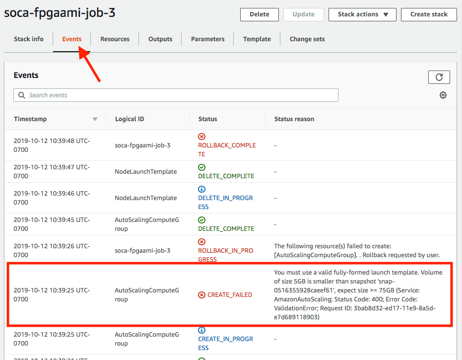
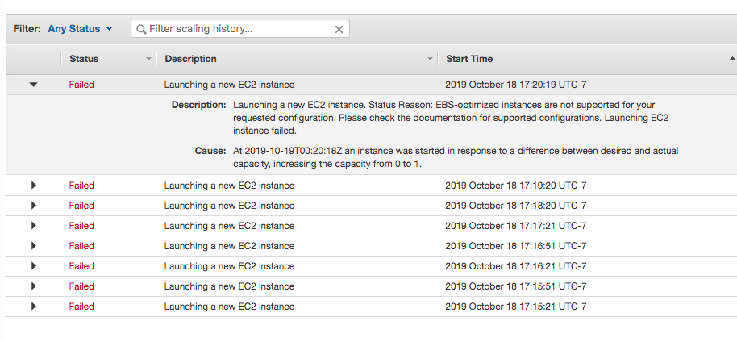

## Jobs in dynamic queue

First of all, unless you submit a job on the "alwayson" queue, it will usually take between 5 to 10 minutes before your job can start as SOCA needs to provision your capacity. This can vary based on the type and number of EC2 instances you have requested for your job.

### Verify the log
If your job is not starting, first verify the queue log under `/apps/soca/cluster_manager/logs/<queue_name>.log`

### Verify the job resource

This guide assume you have created your queue correctly

Run `qstat -f <job_id> | grep -i resource` and try to locate `compute_node` or `stack_id` resource. When your job is launched, these resources does not exist. The script `dispatcher.py`. running as a crontab and executed every 3 minutes will create these resources automatically.

Example of job having all resources configured correctly
~~~bash hl_lines="8 9"
# Job with SOCA resources
bash-4.2$ qstat -f 2 | grep -i resource
    Resource_List.instance_type = m5.large
    Resource_List.ncpus = 3
    Resource_List.nodect = 3
    Resource_List.nodes = 3
    Resource_List.place = scatter
    Resource_List.select = 3:ncpus=1:compute_node=job2 
    Resource_List.stack_id = soca-fpgaami-job-2
~~~

Please note these resources are created by `dispatcher.py` so allow a maximum of 3 minutes between job is submitted and resources are visibles on `qstat` output
~~~bash
# Job without SOCA resources created yet
bash-4.2$ qstat -f 2 | grep -i resource
    Resource_List.instance_type = m5.large
    Resource_List.ncpus = 3
    Resource_List.nodect = 3
    Resource_List.nodes = 3
    Resource_List.place = scatter
    Resource_List.select = 3:ncpus=1
~~~

If you see a `compute_node` different than `tbd` as well as `stack_id`, that means SOCA triggered capacity provisioning by creating a new CloudFormation stack.
If you go to your CloudFormation console, you should see  a new stack being created using the following naming convention: `soca-<cluster_name>-job-<job_id>`

### If CloudFormation stack is NOT "CREATE_COMPLETE"

Click on the stack name then check the "Events" tab and refer to any "CREATE_FAILED" errors

In this example, the size of root device is too small and can be fixed by specify a bigger EBS disk using  `-l root_size=75`

### If CloudFormation stack is "CREATE_COMPLETE"

First, make sure CloudFormation has created a new "Launch Template" for your job.

Then navigate to AutoScaling console, select your AutoScaling group and click "Activity". You will see any EC2 errors related in this tab.

Here is an example of capacity being provisioned correctly

Here is an example of capacity provisioning errors:

If capacity is being provisioned correctly, go back to SOCA and run `pbsnodes -a`. Verify the capacity assigned to your job ID (refer to `resources_available.compute_node`) is in `state = free`.

~~~hl_lines="7"
pbsnodes -a
ip-60-0-174-166
     Mom = ip-60-0-174-166.us-west-2.compute.internal
     Port = 15002
     pbs_version = 18.1.4
     ntype = PBS
     state = free
     pcpus = 1
     resources_available.arch = linux
     resources_available.availability_zone = us-west-2c
     resources_available.compute_node = job2
     resources_available.host = ip-60-0-174-166
     resources_available.instance_type = m5.large
     resources_available.mem = 7706180kb
     resources_available.ncpus = 1
     resources_available.subnet_id = subnet-0af93e96ed9c4377d
     resources_available.vnode = ip-60-0-174-166
     resources_assigned.accelerator_memory = 0kb
     resources_assigned.hbmem = 0kb
     resources_assigned.mem = 0kb
     resources_assigned.naccelerators = 0
     resources_assigned.ncpus = 0
     resources_assigned.vmem = 0kb
     queue = normal
     resv_enable = True
     sharing = default_shared
     last_state_change_time = Sat Oct 12 17:37:28 2019
~~~

If host is not in `state = free` after 10 minutes, SSH to the host, sudo as root and check the log file located under `/root` as well as `/var/log/message | grep cloud-init`
