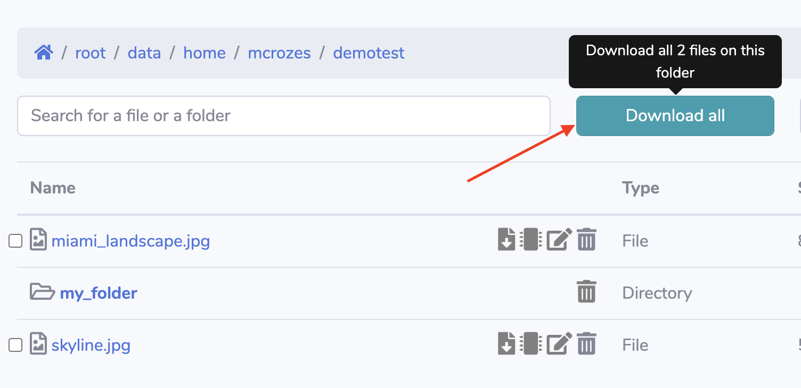
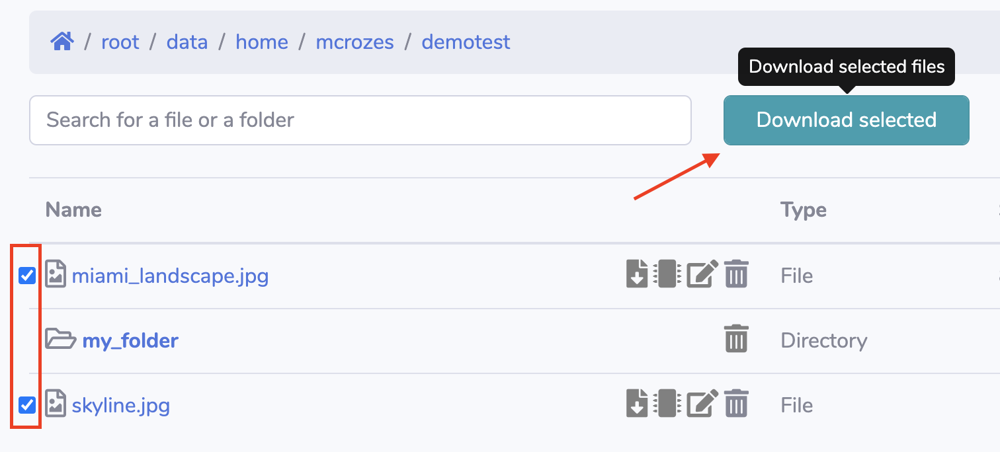
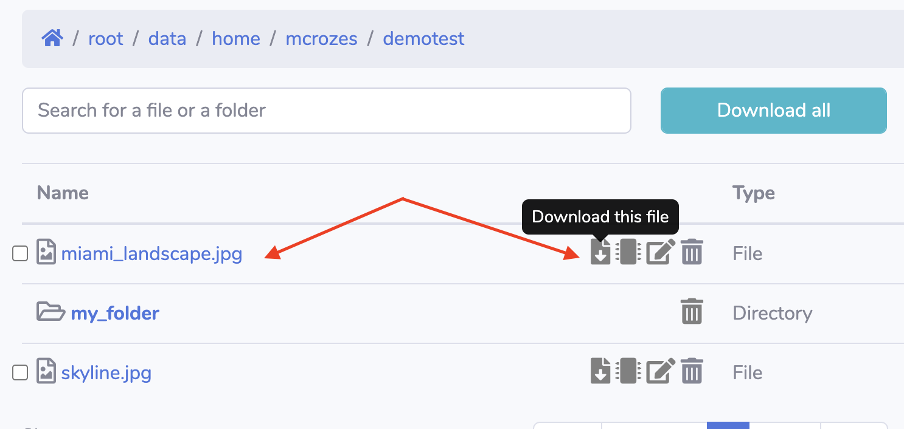
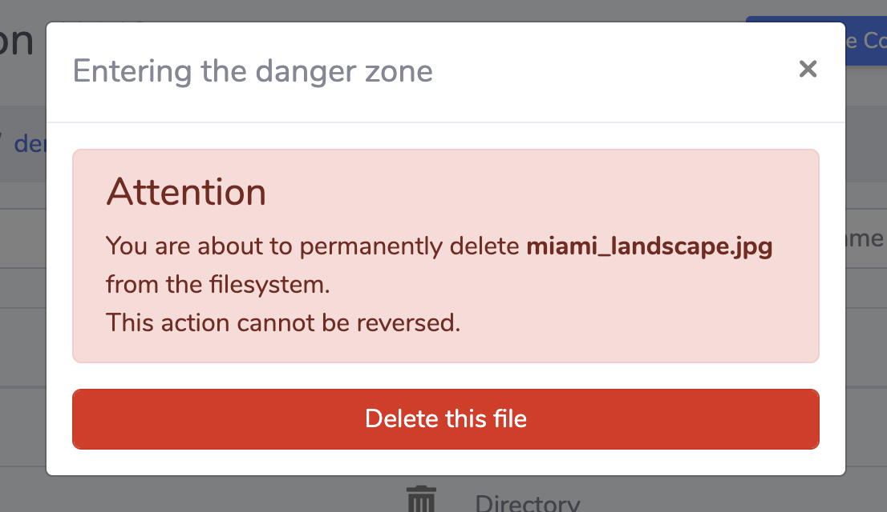
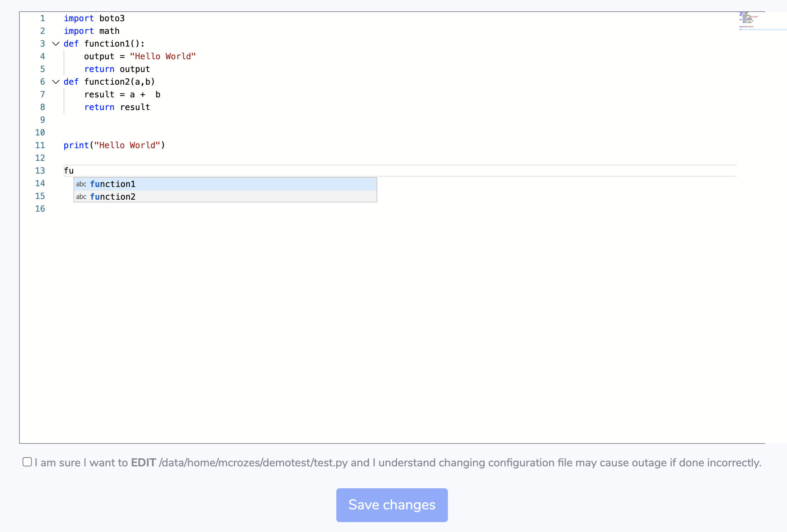

"My Files" section let each user access their filesystem via a web browser.

## Create a new folder

Click "Create Folder" to create a new folder un your current working directory.


Your folder will be created instantly and visible under the File Explorer section.


## Upload files

Click "Upload Files" button then drag and drop (or select) the files you want to upload.


## Download files

### All files in directory

Click "Download All" button to download all files from the current working directory (SOCA will create a zip archive)



### Multiple files

Select the files you want to download by checking the assigned checkboxes them click "Download Selected" button.



### Single file

To download a single file, click on the file name or use the first icon.



## Delete files

To delete a file, simply click the last icon located on the right of the file name.


This will open a confirmation window.



## Edit files

To edit a file, click the 3rd icon located on the right of the file name.


This will open a text editor. The editor includes syntax highlights and auto-completion.



Once you are done with your changes, check the checkbox and click "Save" button.


## Use file as simulation input

[Refer to this page for more information](../submit-hpc-jobs-web-based-interface/#submit-a-test-job)


## Files created via the filesystem are not visible

For better performance, SOCA cache the content of a directory by default for 2 minutes (this settings can be changed in `config.py` via DEFAULT_CACHE_TIME).
If you have created a file via SSH/DCV and this file is not yet visible, simply force a cache refresh by clicking the grey button.


## Permissions & Settings

The web interface rely on POSIX permissions. In other words, creating a file/folder is the same as running "touch" or "mkdir".

Web configuration parameters are listed on `/apps/soca/<YOUR_CLUSTER>/cluster_web_ui/config.py`. A restart is required if you change any of these settings.

```bash
    APPS_LOCATION = "/apps/"
    USER_HOME = "/data/home" # Adjust if you use a different location
    CHROOT_USER = False  # if True, user can only access their $HOME directory (aka: USER_HOME/<user>)
    PATH_TO_RESTRICT = []  # eg: /apps/folder1 -> users can't access anything under /apps/folder1
    DEFAULT_CACHE_TIME = 120  # 2 minutes. Change this value to optimize performance in case you have a large number of concurrent user
    MAX_UPLOAD_FILE = 5120  # 5 GB
    MAX_UPLOAD_TIMEOUT = 1800000  # 30 minutes
    MAX_SIZE_ONLINE_PREVIEW = 150000000  # in bytes (150mb by default), maximum size of file that can be visualized via the web editor
    MAX_ARCHIVE_SIZE = 150000000  # in bytes (150mb by default), maximum size of archive generated when downloading multiple files at once
    DAILY_BACKUP_COUNT = 15  # Keep 15 latest daily backups
```